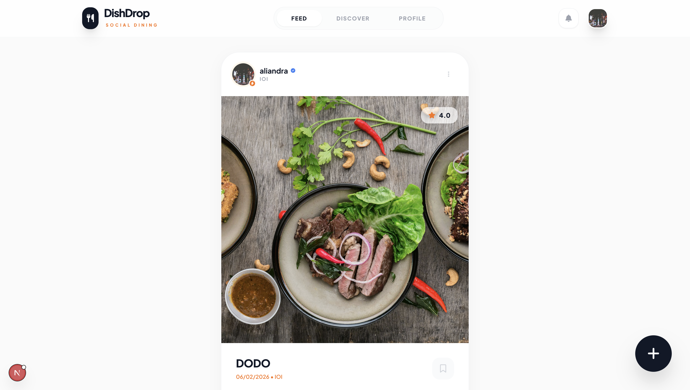

# DishDrop



DishDrop is a social dining Next.js app with Supabase auth and Gemini-powered craving discovery.

## 🚀 Features

- Email/password auth and user profiles (Supabase)
- Create and view food reviews
- AI craving discovery via Gemini
- Save and like reviews
- Mobile-first modern UI

## 🧱 Tech stack

- Next.js 16 (App Router)
- React 19
- TypeScript
- Supabase
- Gemini APIs
- Tailwind CSS

## 🔧 Quick start

1. Clone repository:

```bash
git clone <your-repo-url>
cd dish-drop
```

2. Install dependencies:

```bash
npm install
```

3. Add environment variables in `.env.local`:

```env
NEXT_PUBLIC_SUPABASE_URL=https://your-supabase-url
NEXT_PUBLIC_SUPABASE_ANON_KEY=your-anon-key
GEMINI_API_KEY=your-gemini-api-key
```

4. Start development server:

```bash
npm run dev
```

5. Open browser:

`http://localhost:3000`

## 🧪 Scripts

- `npm run dev` — run development server
- `npm run build` — production build
- `npm run start` — run production server after build
- `npm run lint` — run ESLint

## 📁 Key files

- `app/page.tsx` — main page
- `app/layout.tsx` — app layout
- `app/components/Auth.tsx` — sign-in/up component
- `app/components/PostReview.tsx` — review form
- `app/services/geminiService.ts` — AI craving logic
- `app/lib/supabase.ts` — Supabase client

## ✅ Notes

- Ensure Supabase tables (profiles, reviews, likes, saves) are created and RLS rules configured if needed.
- For production, set env vars in your deploy platform (Vercel recommended).

## 📦 Deploy

Deploy to Vercel or any Next.js host. Set the same env vars in your deployment settings.
